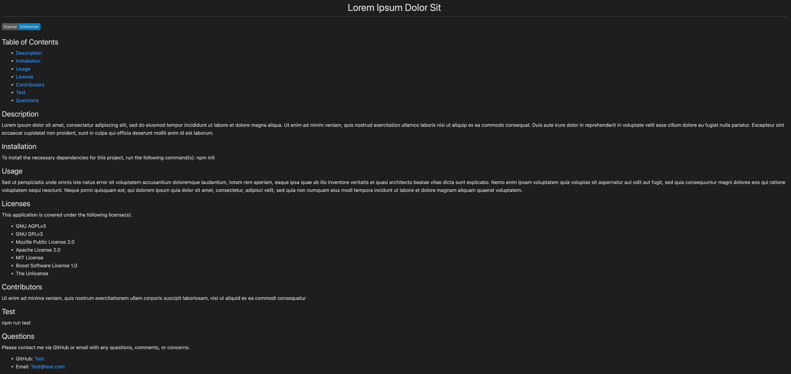

# README Generator 

## Description
This is a node.js application that takes user input from inquirer and creates a README.md file for user repository. The README.me file can be found in the "dist" folder.

## Media
See screenshots of the completed application along with a video link below.

